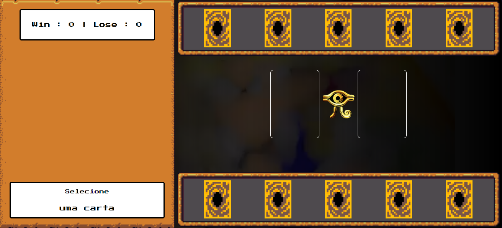
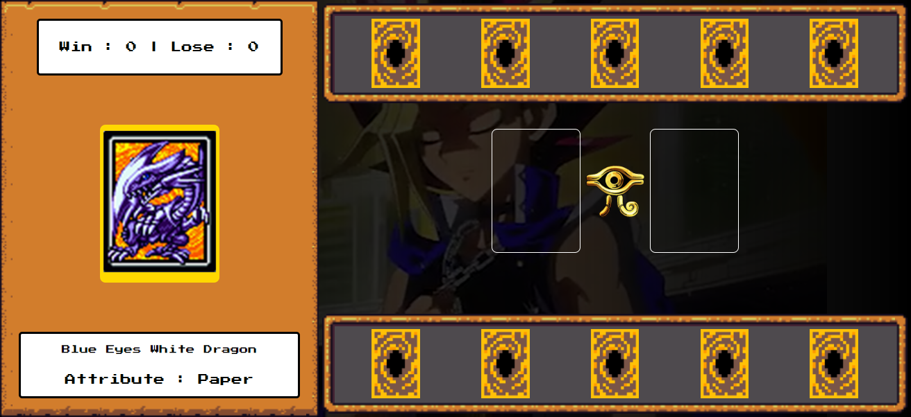
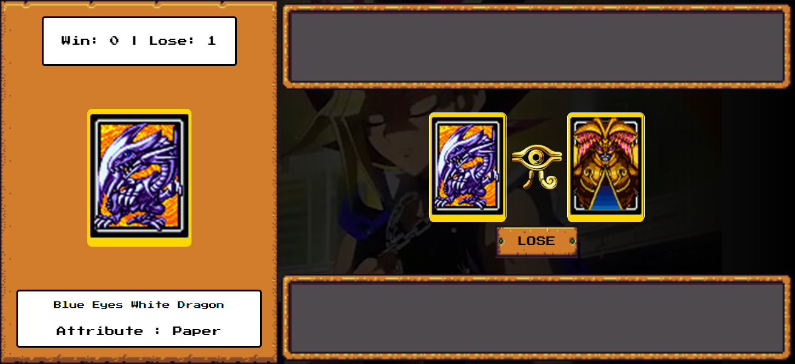

# Jogo de Cartas do Yu-Gi-Oh - Scissor, Paper, Rock
>*Desafio da DIO - Criando um jogo de Cartas do Yu-Gi-Oh! Com JS e CSS*

 
<h2>Como funciona o jogo</h2>

O jogo se baseia no jogo de cartas e no jogo do jankenpon <i>(connhecido também por pedra, papel e tesoura)</i>. Seu inimigo é o computador, que lança aleatoriamente as cartas, com isso você pode ganhar, empatar ou perder, facilmente.

Ademais, a lógica deste jogo é o mesmo que jankenpon, por exemplo, se o inimigo lança pedra e você, a tesoura, logo quem vence é seu inimigo, pois pedra quebra tesoura.

    

        
<u>Scissor</u> - Exodia

        
    

    

        
<u>Paper</u> - Magician

        
    

    

        
<u>Rock</u> - Dragon

        
    

 

Imagens das cartas usadas no jogo. Fonte: **[Felipe Aguiar Code](https://github.com/felipeAguiarCode/js-game-yugioh-jokenpo-edition.git)**

## Diferenças contribuídas
A maior parte do código se assemelha ao original, o que muda é outro som utilizado e a possibilidade de parar a música ao diminuir ou abrir uma nova janela.

## Designer do Jogo

        Imagem antes de iniciar a partida.

---
 

        Decidindo qual carta jogar. Observação: as cartas debaixo são do jogador, e as de cima do inimigo.

---

        Desfecho da partida.

## Créditos
+ [***Assets***](https://github.com/digitalinnovationone/js-yugioh-assets.git)
+ [**Frameworks CSS**](https://github.com/RonenNess/RPGUI.git)
+ [**Songs**](https://downloads.khinsider.com/game-soundtracks/album/yu-gi-oh-power-of-chaos-yugi-the-destiny)